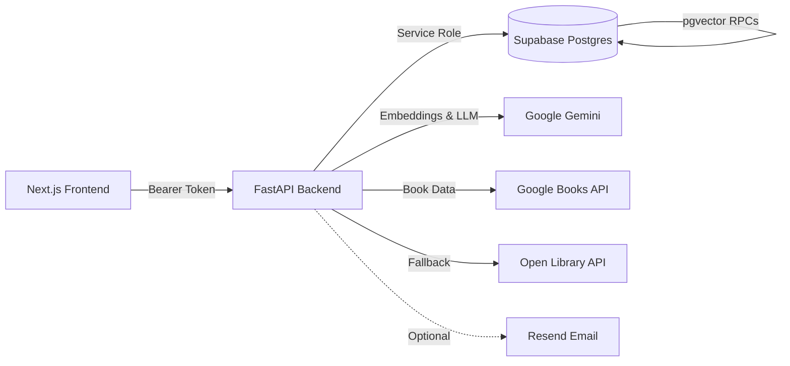

# Aspire Library


> Production-ready full-stack library management platform with role-based workflows, AI-powered search, natural-language book discovery, and personalized recommendations.

---

## Features

### Core Platform
- **Google OAuth** sign-in via Supabase Auth with role-based onboarding (Reader / Librarian)
- **Route-level middleware** — unauthenticated → login, missing profile → onboarding, non-librarian blocked from `/librarian/*`
- **Book catalog** with genre and availability filters, paginated browsing
- **Borrow workflow** — reader requests → librarian approves/rejects → auto copy management
- **Return workflow** — reader submits return → librarian confirms → copies restored
- **Live borrow history** with 10-second auto-refresh polling
- **Book request system** — readers request new titles → librarian reviews → auto-adds to catalog on approval

### AI-Powered Features
- **Smart Search** — hybrid semantic + keyword search with relevance % badges (Gemini Embedding 001 + pgvector)
- **AI Book Discovery** — describe what you want in plain English → Gemini extracts intent → searches Google Books + Open Library → AI ranks results → cross-references your library catalog
- **AI Book Summaries** — Gemini 2.5 Flash generates concise 3–4 sentence summaries, cached in DB (30 req/hr per user)
- **Similar Books** — pgvector cosine similarity finds books with matching embeddings
- **Reader Recommendations** — taste profile built by averaging borrow-history embeddings → finds unread similar books
- **Auto-Embeddings** — 768-dimensional vectors generated automatically on book create/update; batch endpoint for backfill

### Librarian Tools
- **Dashboard** with 6 live stat cards (total books, checked out, overdue, pending returns, book requests, reader count)
- **Book management** — add, edit, delete, CSV bulk import
- **Checkout & return approval** queues
- **Book request review** with notes (approve auto-creates catalog entry)
- **Per-reader recommendations** with optional email delivery via Resend
- **Overdue email reminders** — auto-sent when `RESEND_API_KEY` is configured
- **Batch embedding generation** for catalog backfill

---

## Architecture



**Data flow:**
1. Frontend authenticates via Supabase OAuth → receives JWT
2. Frontend sends JWT as Bearer token to FastAPI endpoints
3. Backend validates token, checks user role, executes business logic
4. Backend reads/writes Supabase Postgres using service-role credentials
5. AI features call Gemini for embeddings/LLM + external book APIs for discovery

---

## Tech Stack

| Layer | Technology | Version |
|---|---|---|
| Frontend | Next.js (App Router), React, TypeScript, Tailwind CSS | 14.2 / 18 / 5 / 3.4 |
| Backend | FastAPI, Pydantic, Uvicorn | 0.115 / 2.9 / 0.30 |
| Auth & DB | Supabase Auth + Postgres | — |
| Vector Search | pgvector (768-dimensional) | — |
| AI / LLM | LangChain + Google Gemini (Embedding 001, Gemini 2.5 Flash) | — |
| External Data | Google Books API + Open Library (fallback) | — |
| Email | Resend (optional) | — |

---

## Quick Start

### Prerequisites

- Node.js 18+ and Python 3.11+
- A [Supabase](https://supabase.com) project
- A [Google API key](https://aistudio.google.com/app/apikey) (Gemini + Google Books)

### 1. Database Setup

Run migrations in order inside the Supabase SQL editor:

```
supabase/migrations/001_initial_schema.sql
supabase/migrations/002_recommendation_rpc.sql
supabase/migrations/003_vector_768.sql
supabase/migrations/004_find_similar_books_rpc.sql
supabase/migrations/005_borrow_status_pending.sql
```

> **Note:** The backend also requires `book_requests` table, `book_summaries` table, and `find_similar_books_for_search` RPC. If these are missing, book requests, AI summaries, and smart semantic ranking will fail at runtime.

Optional seed data: `supabase/seed_books.sql`

Enable **Google OAuth** in Supabase → Auth → Providers → Google.
In Supabase → Auth → URL Configuration:
- Set **Site URL** to your deployed frontend URL (for example, `https://aspire-app-1-1.onrender.com`).
- Add both callback URLs to **Redirect URLs**:
    - `http://localhost:3000/auth/callback`
    - `https://aspire-app-1-1.onrender.com/auth/callback`

### 2. Backend

```bash
cd backend
python3 -m venv venv && source venv/bin/activate
pip install -r requirements.txt
cp .env.example .env      # then fill in values below
uvicorn app.main:app --reload --port 8000
```

| Variable | Required | Purpose |
|---|---|---|
| `SUPABASE_URL` | Yes | Supabase project URL |
| `SUPABASE_ANON_KEY` | Yes | Supabase publishable key |
| `SUPABASE_SERVICE_ROLE_KEY` | Yes | Backend privileged access |
| `FRONTEND_URL` | Yes (prod) | CORS allowed origin |
| `GOOGLE_API_KEY` | Recommended | Gemini AI + Google Books |
| `RESEND_API_KEY` | Optional | Email notifications |

### 3. Frontend

```bash
cd frontend
npm install
cp .env.local.example .env.local   # then fill in values below
npm run dev
```

| Variable | Required | Purpose |
|---|---|---|
| `NEXT_PUBLIC_SUPABASE_URL` | Yes | Supabase URL |
| `NEXT_PUBLIC_SUPABASE_ANON_KEY` | Yes | Supabase anon key |
| `NEXT_PUBLIC_SITE_URL` | Recommended | Frontend base URL for OAuth callback redirect |
| `NEXT_PUBLIC_API_URL` | Yes | FastAPI URL (default `http://localhost:8000`) |

### 4. Promote a Librarian

After first login, run in Supabase SQL editor:

```sql
UPDATE public.users SET role = 'librarian' WHERE email = 'your-email@example.com';
```

Or use the ready-made script: `supabase/promote_librarian.sql`

---

## Live Documentation

The backend serves interactive documentation at runtime:
For full functionality and usage guidance, visit `/info` (or `/info?format=html`).

| URL | Format | Description |
|---|---|---|
| `/info` | JSON | Full feature documentation, all endpoints, AI feature details |
| `/info?format=html` | HTML | Styled documentation page with table of contents |
| `/docs` | Swagger | Interactive OpenAPI / Swagger UI |
| `/health` | JSON | Health check |

---

## API Reference

All endpoints require `Authorization: Bearer <token>` unless noted.

### Auth

| Method | Path | Role | Purpose |
|---|---|---|---|
| `GET` | `/api/auth/me` | Any | Current user profile |
| `POST` | `/api/auth/setup` | Any | Create profile with role |

### Books & Catalog

| Method | Path | Role | Purpose |
|---|---|---|---|
| `GET` | `/api/books` | Any | Paginated catalog (genre/status filters) |
| `GET` | `/api/books/{book_id}` | Any | Book detail |
| `POST` | `/api/books` | Librarian | Create book (auto-generates embedding) |
| `PUT` | `/api/books/{book_id}` | Librarian | Update book (regenerates embedding) |
| `DELETE` | `/api/books/{book_id}` | Librarian | Delete book |
| `POST` | `/api/books/import-csv` | Librarian | Bulk CSV import |
| `POST` | `/api/books/generate-embeddings` | Librarian | Batch-generate missing embeddings |

### Search & AI

| Method | Path | Role | Rate Limit | Purpose |
|---|---|---|---|---|
| `GET` | `/api/books/search` | Any | — | Classic keyword search |
| `GET` | `/api/books/smart-search` | Any | — | AI hybrid semantic + keyword search |
| `GET` | `/api/books/{book_id}/similar` | Any | — | Similar books (pgvector) |
| `GET` | `/api/books/{book_id}/summary` | Any | 30/hr | AI book summary (Gemini, cached) |
| `POST` | `/api/books/discover` | Any | 10/hr | Paragraph-based AI discovery |

### Borrowing

| Method | Path | Role | Purpose |
|---|---|---|---|
| `POST` | `/api/borrow` | Any | Request checkout |
| `POST` | `/api/borrow/return` | Any | Request return |
| `GET` | `/api/borrow/history` | Any | Current user borrow history |
| `GET` | `/api/borrow/overdue` | Librarian | All overdue records |

### Librarian

| Method | Path | Purpose |
|---|---|---|
| `GET` | `/api/librarian/dashboard` | Dashboard stats |
| `GET` | `/api/librarian/readers` | Reader list with counts |
| `GET` | `/api/librarian/readers/{user_id}` | Reader profile |
| `GET` | `/api/librarian/readers/{user_id}/history` | Reader borrow history |
| `GET` | `/api/librarian/readers/{user_id}/recommendations` | AI recommendations |
| `POST` | `/api/librarian/readers/{user_id}/send-recommendations` | Email recommendations |
| `GET` | `/api/librarian/pending-checkouts` | Pending checkout queue |
| `POST` | `/api/librarian/borrow/{borrow_id}/approve` | Approve checkout |
| `POST` | `/api/librarian/borrow/{borrow_id}/reject` | Reject checkout |
| `GET` | `/api/librarian/pending-returns` | Pending return queue |
| `POST` | `/api/librarian/approve-return` | Approve return |

### Book Requests

| Method | Path | Role | Purpose |
|---|---|---|---|
| `POST` | `/api/book-requests` | Any | Submit request |
| `GET` | `/api/book-requests` | Any | My requests |
| `GET` | `/api/librarian/book-requests` | Librarian | All requests (optional `?status=` filter) |
| `POST` | `/api/librarian/book-requests/{request_id}/review` | Librarian | Approve/reject with notes |

---

## Deployment

| Component | Recommended Provider |
|---|---|
| Frontend | Vercel |
| Backend | Render / Railway / Fly.io |
| Database & Auth | Supabase |

### Production Checklist

- [ ] Set `FRONTEND_URL` in backend to production frontend origin
- [ ] Set `NEXT_PUBLIC_API_URL` in frontend to production backend URL
- [ ] For Render backend, set Root Directory to `backend` so `backend/runtime.txt` (Python 3.12) is applied
- [ ] Configure Supabase OAuth redirect to production callback URL
- [ ] Store all secrets in provider secret managers (never in repo)
- [ ] Enforce HTTPS on both frontend and backend domains
- [ ] Ensure `GOOGLE_API_KEY` is set for AI features
- [ ] Optionally set `RESEND_API_KEY` for email notifications
- [ ] Be aware: in-memory rate limiter is per-instance (not shared across scaled processes)

---

## Operational Notes

| Concern | Detail |
|---|---|
| Health check | `GET /health` → `{"status": "healthy"}` |
| API info | `GET /info` (JSON) or `GET /info?format=html` (browser) |
| Overdue detection | Runs inline during borrow/history flows (no background scheduler) |
| Overdue emails | Auto-sent when overdue records detected and `RESEND_API_KEY` is set |
| Rate limits | In-memory sliding window, per-user, resets on server restart |
| Embeddings | Auto-generated on create/update; batch endpoint for backfill |
| Recommendation quality | Improves after all catalog books have embeddings generated |

---

## Repository Structure

```
├── README.md                  ← You are here
├── 1-foundation.md            ← Milestone 1 spec
├── 2-core-features.md         ← Milestone 2 spec
├── 3-advanced-ai.md           ← Milestone 3 spec
├── 4-ai-features.md           ← Milestone 4 spec
├── backend/
│   ├── app/
│   │   ├── main.py            ← FastAPI app + /info endpoint
│   │   ├── core/              ← Config, auth, rate limiting, Supabase client
│   │   ├── routers/           ← Route handlers (books, borrow, librarian, search, etc.)
│   │   ├── schemas/           ← Pydantic request/response models
│   │   └── services/          ← Business logic (AI, embeddings, discovery, email)
│   └── requirements.txt
├── frontend/
│   ├── src/
│   │   ├── app/               ← Next.js pages (App Router)
│   │   ├── components/        ← React components
│   │   └── lib/               ← API client, Supabase helpers
│   └── package.json
└── supabase/
    ├── migrations/            ← SQL migrations (001–005)
    ├── seed_books.sql         ← Sample catalog data
    └── promote_librarian.sql  ← Quick role promotion script
```
